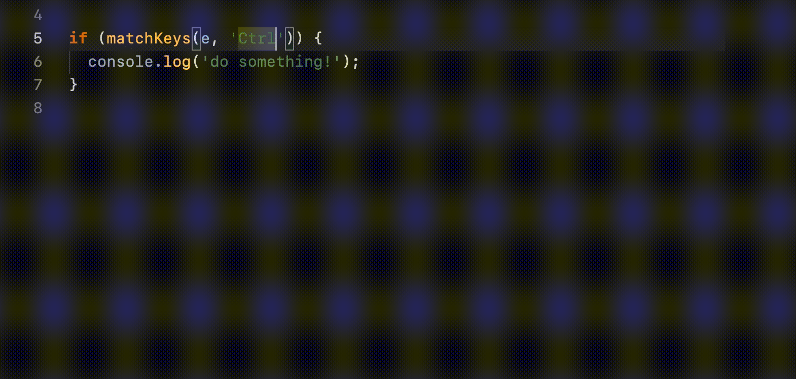

# typed-keys

## Handle keyboard input with type hints!



## Example

```javascript
// returns true if the keyboard input event is the key R
matchKeys(e, "R");
```

```javascript
// check for multiple key combinations
matchKeys(e, ["Ctrl+P", "Shift+Alt+K"]);
```

## Install

### Node.js

```bash
npm install typed-keys
```

or

```bash
yarn add typed-keys
```

### CDN

```javascript
<script src="https://cdn.jsdelivr.net/gh/MarkintoshZ/Scribbled@latest/dist/scribbled.min.js">
```

### _Have fun coding!_
